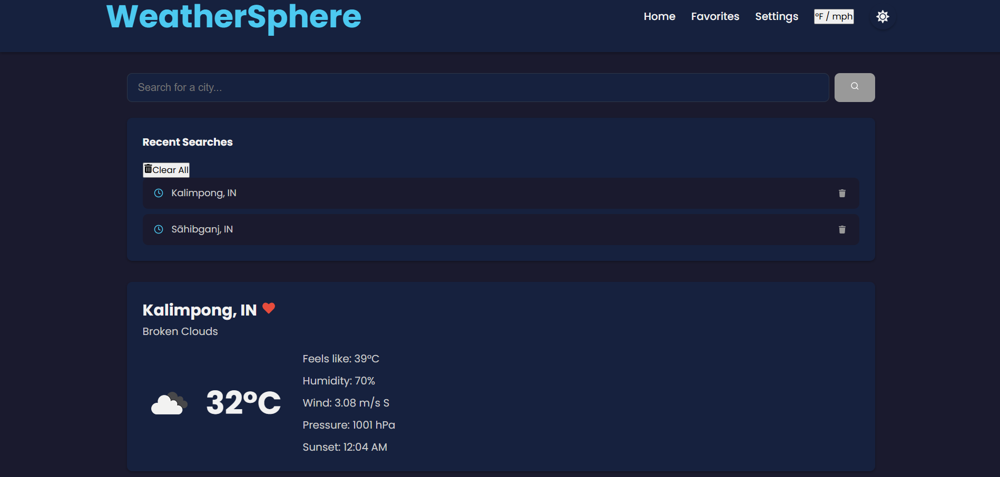
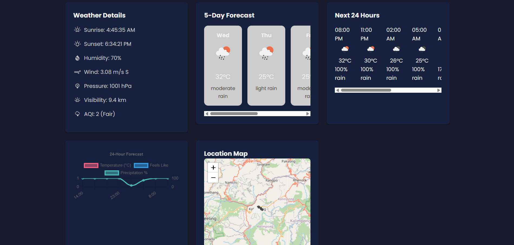
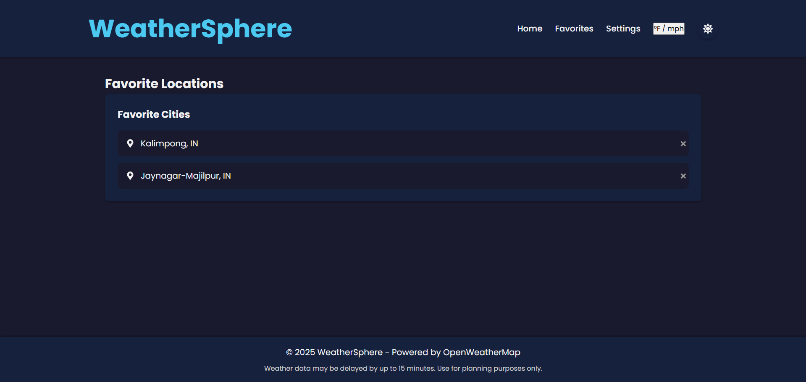

# 🌦️ WeatherSphere

**WeatherSphere** is a sleek, full-featured weather forecast web application that delivers **real-time weather updates**, **5-day forecasts**, **air quality data**, and a modern **dark/light mode UI toggle** — all through a beautifully responsive interface.

Built with **React.js** on the frontend and **Node.js + Express.js** on the backend, it integrates the powerful **OpenWeatherMap API** to bring weather intelligence right to your screen.

---

## 🌐 Live Preview

> ⚠️ This app is designed for **local fullstack deployment** (React + Node.js).

---

## 🖼️ Screenshots

### 🏠 Home Page


### 📋 Home Page


### 📊 Favourite Page


---

## ✨ Features

- 🔍 **City Weather Search** – Get real-time weather updates for any global city.
- 📋 **Recent Searches** – View and clear recently searched cities.
- 🌡️ **Live Weather Data** – Shows temperature, feels like, rain probability, sunrise/sunset time, and city name.
- 📊 **Weather Details Analytics** – Includes sunrise/sunset, humidity, wind speed & direction, pressure, visibility, and air quality index.
- 🕒 **24-Hour Forecast** – Hourly breakdown with temperature, weather icons, and rain chances.
- 📅 **5-Day Forecast** – Daily summaries with temperature trends and weather conditions.
- ❤️ **Favorites List** – Save and quickly access frequently searched cities.
- 🌐 **Location Mapping** – Interactive map view for the selected city.
- 🌓 **Dark / Light Mode Toggle** – Switch themes for day or night viewing.
- ⚙️ **Unit Toggle** – Convert between **°C/°F** and **m/s or mph**.
  
---

## 🛠 Tech Stack

| Frontend           | Backend              | APIs Used               |
|--------------------|----------------------|--------------------------|
| React.js           | Node.js + Express.js | OpenWeatherMap API       |
| CSS (Custom)       | Axios                | Geo, Weather, Air Quality |
| Leaflet.js         | dotenv               |                          |

---

## 📁 Folder Structure

weather-forecast-app/
├── backend/ # Express backend
│ ├── server.js # Entry point
│ ├── .env # API key (not tracked)
│ ├── package.json
├── public/ # Static public assets
├── screenshots/ # Screenshots of web pages
├── src/ # React frontend
│ ├── api/ # API request logic
│ ├── assets/ # Images, icons, etc.
│ ├── components/ # Reusable UI components
│ ├── contexts/ # React context providers (e.g., theme, favorites)
│ ├── hooks/ # Custom React hooks
│ ├── pages/ # App pages (e.g., Home, Settings)
│ ├── services/ # Utility services (e.g., weather API abstraction)
│ ├── utils/ # Helper functions
│ ├── App.js
│ ├── App.css
│ ├── index.js # App entry point
│ ├── index.css
│ ├── reportWebVitals.js
│ ├── setupTests.js
├── .gitignore
├── package.json
├── README.md

---

## 🚀 Local Setup

> ⚙️ This serves **frontend and backend** from a single server using Express.

### 1. Clone the Repository

```bash
git clone https://github.com/Subhankar191/weather-forecast-app.git
cd weather-forecast-app
```

### 2. Build React Frontend

```bash
npm install
npm run build
```

Copy the production build to backend:

```bash
cp -r build backend/
```

### 3. Setup Backend

```bash
cd backend
npm install
```

Create a `.env` file in `/backend`:

```env
OPENWEATHER_API_KEY=your_openweathermap_api_key
```

### 4. Run the Fullstack Server

```bash
node server.js
```

Then visit: **http://localhost:5000**

---

## 🔗 Backend API Endpoints

| Method | Endpoint         | Description                  |
|--------|------------------|------------------------------|
| GET    | `/api/current`   | Current weather by location  |
| GET    | `/api/forecast`  | 5-day forecast               |
| GET    | `/api/hourly`    | Filtered hourly forecast     |
| GET    | `/api/air`       | Air Quality Index            |

---

## 🧠 What You'll Learn

- Fullstack integration of React and Node.js
- Consuming third-party REST APIs (OpenWeatherMap)
- Secure API key management using `.env`
- Responsive design and conditionally rendered components
- Serving production React build via Express
- Building dark/light UI themes

---

## 🔥 Bonus Feature: Dark / Light Mode

WeatherSphere offers a **modern dark mode toggle** with stateful theme switching. Users can enjoy the app in the mode they prefer, whether day or night.

---

## 📝 To-Do

- ✅ Add geolocation support
- ✅ Dark/Light Mode toggle
- ⬜ Persistent favorites
- ⬜ Internationalization (i18n)
- ⬜ Offline support / caching

---

## 🛡️ License

This project is licensed under the **MIT License**.  
Feel free to fork, use, or extend it for your own projects.

---

> 💙 Crafted with care by **Subhankar Das**  
> Inspired by the skies, built with JavaScript.
